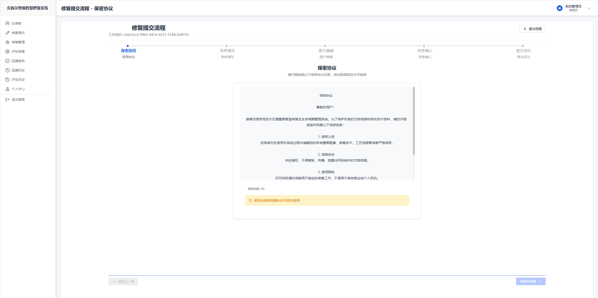
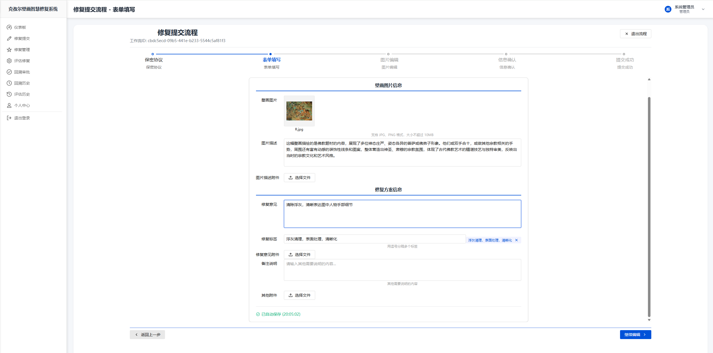
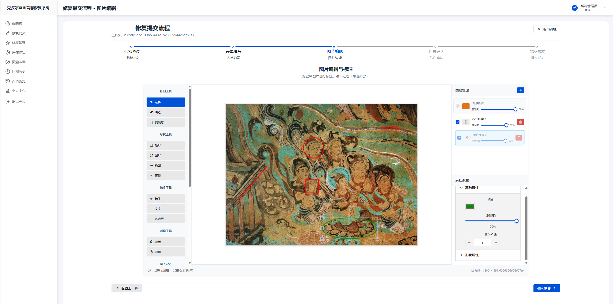
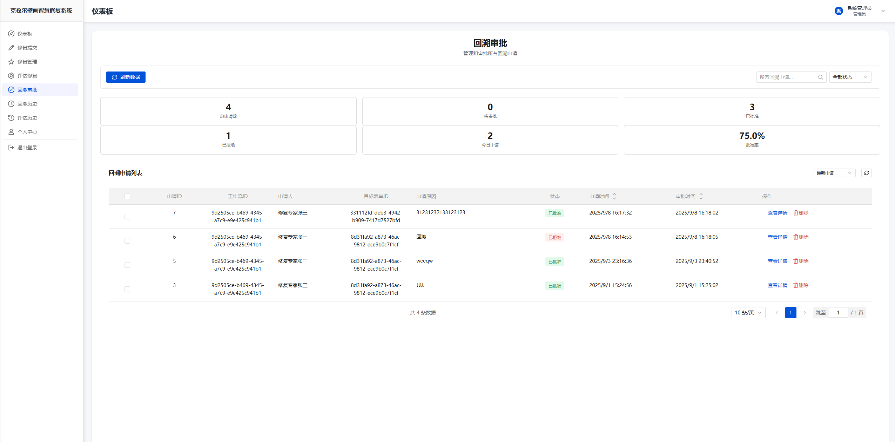

# Vue3前端版本 - 克孜尔石窟壁画智慧修复系统

<div align="center">


**现代化的Vue3前端应用**

[快速开始](#-快速开始) • [功能展示](#-功能展示) • [技术栈](#-技术栈) • [开发指南](#-开发指南)

</div>

---

## 📋 目录

- [项目简介](#-项目简介)
- [功能展示](#-功能展示)
- [技术栈](#-技术栈)
- [项目结构](#-项目结构)
- [快速开始](#-快速开始)
- [开发指南](#-开发指南)
- [API对接](#-api对接)
- [部署说明](#-部署说明)
- [注意事项](#-注意事项)

## 🎯 项目简介

本项目是基于Vue3重构的现代化前端应用，专为克孜尔石窟壁画智慧修复全生命周期管理系统设计。采用最新的Vue3 Composition API、TDesign组件库和现代化的开发工具链，提供更好的开发体验和用户体验。

### 核心特性

- **🚀 现代化技术栈**: Vue3 + Vite + TDesign
- **📱 响应式设计**: 支持多设备适配
- **🎨 美观界面**: 基于TDesign设计语言
- **⚡ 高性能**: Vite构建工具，快速热更新
- **🔧 易维护**: 模块化组件设计

## 🖼️ 功能展示

### 🔐 登录页面


**功能特点：**
- 简洁优雅的登录界面
- 支持用户名/密码登录
- 自动记住登录状态
- 响应式设计，适配各种屏幕

### 📊 仪表盘页面


**功能特点：**
- 实时数据统计展示
- 多角色权限控制
- 工作流状态监控
- 最近活动记录
- 趋势分析图表

### 🔄 修复提交页面

#### 保密协议确认


**功能特点：**
- 数字化保密协议展示
- 在线签署确认机制
- 协议条款详细说明
- 法律责任明确告知
- 签署状态实时跟踪

#### 文件上传管理


**功能特点：**
- 多格式文件支持（图片、文档、视频）
- 拖拽式上传体验
- 文件预览和管理
- 上传进度实时显示
- 文件大小和格式验证
- 批量上传处理

#### 图片标注工具


**功能特点：**
- 智能图片标注工具
- 多种标注类型（点、线、面、文字）
- 标注信息详细记录
- 标注历史版本管理
- 协作标注功能
- 标注数据导出


### 🔧 修复管理页面


**功能特点：**
- 工作流创建和管理
- 多步骤表单设计
- 文件上传和预览
- 修复意见记录
- 状态跟踪和更新

### 📋 评估修复页面


**功能特点：**
- 修复方案评估
- 多维度评分系统
- 详细评估意见
- 评估历史查询
- 质量统计分析

### 📋 回溯审批页面



**功能特点：**
- 完整的审批流程管理
- 多级审批权限控制
- 审批意见详细记录
- 审批历史完整追溯
- 审批状态实时更新
- 审批时限监控提醒
- 审批结果统计分析
- 审批文档自动归档

**审批流程：**
1. **初审阶段** - 基础信息和材料完整性检查
2. **专业评估** - 技术专家专业意见评估
3. **风险评估** - 修复风险和可行性分析
4. **最终审批** - 项目负责人最终决策
5. **结果通知** - 审批结果自动通知相关人员


## 🛠️ 技术栈

### 核心框架
- **Vue 3.3+** - 渐进式JavaScript框架
- **Vite 4.0+** - 下一代前端构建工具
- **Vue Router 4** - 官方路由管理器
- **Pinia** - Vue状态管理库

### UI组件库
- **TDesign** - 腾讯企业级设计语言和Vue组件库
- **TDesign Icons** - 图标库

### 开发工具
- **ESLint** - 代码质量检查
- **Prettier** - 代码格式化
- **TypeScript** - 类型安全（可选）

### 构建部署
- **Vite** - 构建工具
- **Nginx** - 生产环境部署

## 📁 项目结构

```
webapp/
├── public/                 # 静态资源
│   ├── favicon.ico        # 网站图标
│   └── login-background.png # 登录背景图
├── src/                   # 源代码目录
│   ├── api/              # API接口
│   │   ├── request.js    # 请求封装
│   │   ├── dashboard.js  # 仪表盘API
│   │   ├── management.js # 修复管理API
│   │   ├── evaluation.js # 评估API
│   │   ├── submission.js # 修复提交API
│   │   ├── approval.js   # 回溯审批API
│   │   └── upload.js     # 文件上传API
│   ├── components/       # 公共组件
│   │   ├── Header.vue    # 头部组件
│   │   ├── Sidebar.vue   # 侧边栏组件
│   │   ├── Layout.vue    # 布局组件
│   │   └── Trend.vue     # 趋势图表组件
│   ├── views/            # 页面组件
│   │   ├── Login.vue     # 登录页面
│   │   ├── Dashboard.vue # 仪表盘
│   │   ├── Management.vue # 修复管理
│   │   ├── Evaluation.vue # 评估页面
│   │   ├── Submission.vue # 修复提交页面
│   │   ├── Approval.vue  # 回溯审批页面
│   │   └── ...
│   ├── router/           # 路由配置
│   │   └── index.js      # 路由定义
│   ├── utils/            # 工具函数
│   │   └── auth.js       # 认证工具
│   ├── App.vue           # 根组件
│   └── main.js           # 入口文件
├── index.html            # HTML模板
├── package.json          # 项目配置
├── vite.config.js        # Vite配置
└── README.md             # 项目说明
```

## 🚀 快速开始

### 环境要求

- **Node.js**: 16.0+
- **npm**: 8.0+ 或 **yarn**: 1.22+
- **现代浏览器**: Chrome 88+, Firefox 78+, Safari 14+

### 安装依赖

```bash
# 进入项目目录
cd webapp

# 安装依赖
npm install
# 或
yarn install
```

### 开发环境

```bash
# 启动开发服务器
npm run dev
# 或
yarn dev

# 访问 http://localhost:5173
```

### 构建生产版本

```bash
# 构建生产版本
npm run build
# 或
yarn build

# 预览生产版本
npm run preview
# 或
yarn preview
```

## 🔧 开发指南

### 代码规范

#### 组件命名
- 使用PascalCase命名组件文件
- 组件名使用kebab-case在模板中

```vue
<!-- 组件文件: UserProfile.vue -->
<template>
  <div class="user-profile">
    <!-- 组件内容 -->
  </div>
</template>
```

#### 目录结构规范
```
src/
├── components/     # 可复用组件
├── views/         # 页面级组件
├── api/           # API接口
├── utils/         # 工具函数
├── router/        # 路由配置
└── assets/        # 静态资源
```

### 组件开发

#### 创建新组件

```vue
<template>
  <div class="component-name">
    <h3>{{ title }}</h3>
    <slot></slot>
  </div>
</template>

<script>
export default {
  name: 'ComponentName',
  props: {
    title: {
      type: String,
      required: true
    }
  },
  setup(props) {
    // Composition API 逻辑
    return {
      // 返回响应式数据和方法
    }
  }
}
</script>

<style scoped>
.component-name {
  /* 组件样式 */
}
</style>
```

### 状态管理

使用Pinia进行状态管理：

```javascript
// stores/user.js
import { defineStore } from 'pinia'

export const useUserStore = defineStore('user', {
  state: () => ({
    userInfo: null,
    token: null
  }),
  
  actions: {
    setUserInfo(userInfo) {
      this.userInfo = userInfo
    },
    
    setToken(token) {
      this.token = token
    }
  }
})
```

## 🔗 API对接

### 请求封装

```javascript
// api/request.js
import axios from 'axios'

const request = axios.create({
  baseURL: 'http://localhost:8080/api',
  timeout: 10000
})

// 请求拦截器
request.interceptors.request.use(
  config => {
    const token = localStorage.getItem('token')
    if (token) {
      config.headers.Authorization = `Bearer ${token}`
    }
    return config
  },
  error => {
    return Promise.reject(error)
  }
)

// 响应拦截器
request.interceptors.response.use(
  response => {
    return response.data
  },
  error => {
    // 错误处理
    return Promise.reject(error)
  }
)

export default request
```

### API接口示例

#### 仪表盘API
```javascript
// api/dashboard.js
import request from './request'

export const getDashboardData = () => {
  return request.get('/dashboard')
}

export const getUserInfo = () => {
  return request.get('/user/me')
}
```

## 🚀 部署说明

### 开发环境部署

```bash
# 1. 安装依赖
npm install

# 2. 启动开发服务器
npm run dev

# 3. 访问 http://localhost:5173
```

### 生产环境部署

```bash
# 1. 构建生产版本
npm run build

# 2. 部署到Web服务器
# 将dist目录内容复制到Web服务器根目录

# 3. 配置Nginx（可选）
server {
    listen 80;
    server_name your-domain.com;
    root /path/to/dist;
    index index.html;
    
    location / {
        try_files $uri $uri/ /index.html;
    }
}
```

## ⚠️ 注意事项

### 开发注意事项

1. **后端接口对接**
   - 确保后端服务正常运行（http://localhost:8080）
   - 检查API接口路径和参数格式
   - 注意跨域配置

2. **TDesign组件库**
   - 参考[TDesign官方文档](https://tdesign.tencent.com/)
   - 使用最新版本的组件API
   - 注意组件的props和events

3. **分页字段处理**
   - 部分后端接口的分页字段可能需要调整
   - 检查分页参数格式（page, size, limit等）
   - 统一分页组件的使用方式

4. **路由配置**
   - 确保路由路径与后端API路径一致
   - 配置路由守卫进行权限控制
   - 处理404页面和错误页面

5. **状态管理**
   - 合理使用Pinia进行状态管理
   - 避免过度使用全局状态
   - 注意状态的持久化

6. **文件上传处理**
   - 实现文件类型和大小验证
   - 添加上传进度显示
   - 处理上传失败的重试机制
   - 支持大文件分片上传
   - 实现文件预览功能

7. **图片标注功能**
   - 确保Canvas绘制性能优化
   - 实现标注数据的序列化和反序列化
   - 支持标注的撤销和重做操作
   - 添加标注的导入导出功能
   - 处理高分辨率图片的缩放显示

8. **审批流程管理**
   - 实现审批状态的实时更新
   - 添加审批超时提醒功能
   - 支持审批流程的可视化展示
   - 处理并发审批的冲突问题
   - 实现审批历史的完整记录

9. **保密协议处理**
   - 确保协议内容的安全传输
   - 实现数字签名验证
   - 记录签署时间和IP地址
   - 支持协议版本管理
   - 添加协议撤销机制

### 性能优化

1. **代码分割**
   ```javascript
   // 路由懒加载
   const Dashboard = () => import('@/views/Dashboard.vue')
   ```

2. **组件优化**
   ```vue
   <script>
   import { defineAsyncComponent } from 'vue'
   
   export default {
     components: {
       HeavyComponent: defineAsyncComponent(() => import('./HeavyComponent.vue'))
     }
   }
   </script>
   ```

3. **图片优化**
   - 使用WebP格式
   - 实现图片懒加载
   - 压缩图片资源

### 浏览器兼容性

- **现代浏览器**: Chrome 88+, Firefox 78+, Safari 14+, Edge 88+
- **移动端**: iOS Safari 14+, Chrome Mobile 88+
- **不支持**: IE浏览器

---

<div align="center">

**Vue3前端版本 - 现代化、高性能、易维护**

Made with ❤️ by 王梓涵

</div>